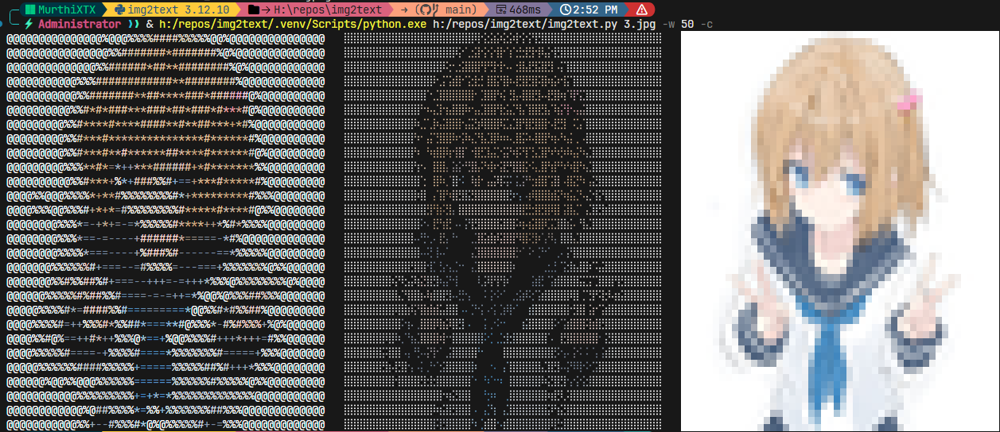

# Img2Text 图片转彩色字符画
<div align=left>
   
   
   
   
   
</div>

将图片转换为终端字符画的命令行工具，支持 **ASCII 字符**、**盲文点阵 (Braille)** 和 **半色块 (▀)** 三种风格，均保留原始图像颜色，并支持透明 PNG。

## ✨ 特性

- 🎨 **全彩色输出** – 使用 ANSI 转义序列为每个字符/色块设置前景色或背景色（可选）
- 🖼️ **透明支持** – 自动识别透明区域，输出为空格并重置样式
- 🔠 **三种渲染模式** – 一次运行同时生成三种风格的字符画
- ⚙️ **可调参数** – 输出宽度、透明度阈值、颜色开关等


- 测试图片作者为CORE，若有侵权请联系删除。

## 📦 依赖

- Python 3.7+
- [Pillow](https://python-pillow.org)
- [NumPy](https://numpy.org)
- [SciPy](https://scipy.org)（仅盲文模式需要）
- [Click](https://click.palletsprojects.com/)（命令行解析）

安装依赖：

```bash
pip install pillow numpy scipy click
```

## 🚀 命令行使用

将 `braille.py`、`colorblocks.py`、`asciichr.py`、`img2text.py` 放在同一目录，执行：

```bash
python img2text.py [选项] <图片路径>
```

或打包为 `img2text.exe` 后直接运行：

```bash
img2text.exe [选项] <图片路径>
```

### 参数说明

| 参数 | 说明 |
|------|------|
| `图片路径` | 必需，待转换的图片文件（支持 PNG、JPEG 等） |
| `-w, --width` | 输出字符宽度，默认 50 |
| `-a, --alpha_threshold` | Alpha 通道阈值（0-255），低于此值视为透明，默认 128 |
| `-c, --colored` | 标志，加上后输出带 ANSI 颜色的字符画；不加则输出纯文本 |
| `-m, --mode` | 输出模式：`a`=ASCII, `b`=盲文, `c`=半色块；不指定则输出全部三种 |
| `-o, --output` | 输出文件名；不指定则使用默认名称。未指定 mode 时会在后缀前自动添加 `_a`/`_b`/`_c` |

### 示例

```bash
# 宽度 80，使用默认透明度阈值，无颜色
python img2text.py logo.png -w 80

# 启用颜色，宽度 100，透明度阈值 200
python img2text.py logo.png -w 100 -a 200 -c

# 简写形式
python img2text.py logo.png -w 60 -c

# 只输出 ASCII 模式
python img2text.py logo.png -m a

# 只输出盲文模式，并指定文件名
python img2text.py logo.png -m b -o braille.txt

# 输出三种模式，并指定基础文件名（生成 result_a.txt, result_b.txt, result_c.txt）
python img2text.py logo.png -o result.txt

# 组合使用：彩色 ASCII，宽度 80，指定输出文件名
python img2text.py logo.png -w 80 -c -m a -o ascii_art.txt
```

### 输出说明

- **终端显示**：若未指定 mode，三种风格的结果并排显示；若指定了 mode，仅显示该模式结果
- **文件保存**：
  - 未指定 `-m` 和 `-o`：生成 `a.txt`、`b.txt`、`c.txt`
  - 指定了 `-m` 未指定 `-o`：生成对应模式的默认文件（如 `-m a` 生成 `a.txt`）
  - 指定了 `-m` 和 `-o`：生成单个指定文件（如 `-m a -o out.txt` 生成 `out.txt`）
  - 未指定 `-m` 但指定了 `-o`：生成三个文件，在扩展名前自动添加后缀区分（如 `-o result.txt` 生成 `result_a.txt`、`result_b.txt`、`result_c.txt`）

所有文件均以 UTF-8 编码保存，可直接在支持 ANSI 颜色的终端中查看或使用 `cat`/`type` 命令显示。

## 📖 模块调用（可选）

你也可以在 Python 脚本中单独调用各个模块，所有函数均支持 `colored` 参数。

```python
from asciichr import image_to_asciichr
from braille import image_to_braille
from colorblocks import image_to_color_blocks

# 无颜色输出
ascii_lines = image_to_asciichr('1.png', output_width=80, colored=False)

# 彩色输出
braille_lines = image_to_braille('1.png', output_width=80, colored=True)
```

各函数的详细参数请参考源码中的 docstring。

## 🖥️ 终端兼容性

- 使用彩色模式（`-c`）时，需要终端支持 **真彩色**（24-bit ANSI 颜色）：
  - Windows Terminal (>=1.0)
  - macOS Terminal (iTerm2, Terminal.app 支持较好)
  - Linux (GNOME Terminal, Konsole, etc.)
- 盲文字符需要终端字体支持 Unicode 范围 `U+2800–U+28FF`（现代终端基本都支持）。
- 无颜色模式（纯文本）可在任何终端下正常显示。

## 📄 示例输出

运行 `img2text.exe logo.png -w 80 -c` 后，终端输出类似：

```
ASCII结果行   盲文结果行   半色块结果行
...           ...         ...
```

同时生成 `a.txt`、`b.txt`、`c.txt` 三个文件。

## 🤝 贡献

欢迎提交 Issue 或 Pull Request。

## 📜 许可证

本项目采用 **MIT 许可证**。详情请参阅 [LICENSE](LICENSE) 文件。